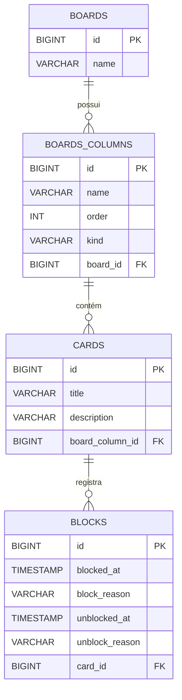
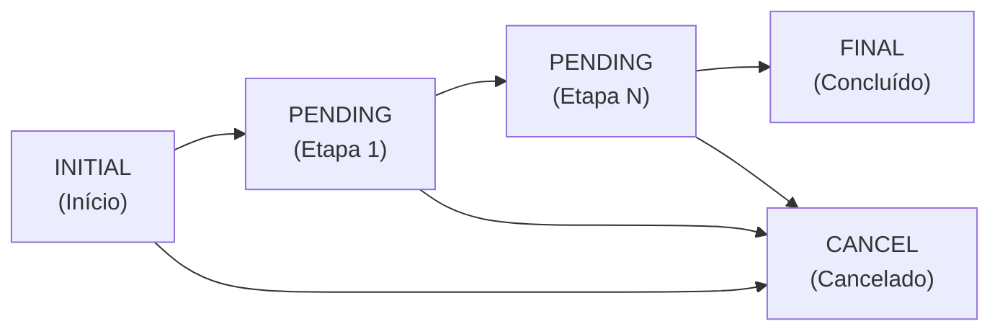

# Board - Gerenciador de Quadro Kanban


Aplicação CLI para gerenciamento de quadros Kanban, desenvolvida em Java. Permite criar boards com colunas customizáveis, gerenciar cards com movimentação sequencial entre colunas, bloqueio/desbloqueio com histórico de motivos e cancelamento direto.

## Funcionalidades

- **Gerenciamento de Boards** - Criar, selecionar e excluir boards
- **Colunas Customizáveis** - Cada board possui colunas dos tipos INITIAL, PENDING (quantidade variável), FINAL e CANCEL
- **Criação de Cards** - Cards com título e descrição, criados automaticamente na coluna inicial
- **Movimentação Sequencial** - Cards avançam coluna por coluna seguindo a ordem definida
- **Cancelamento Direto** - Cards podem ser movidos para a coluna de cancelamento a qualquer momento
- **Bloqueio/Desbloqueio** - Cards podem ser bloqueados com motivo, impedindo qualquer movimentação até o desbloqueio
- **Histórico de Bloqueios** - Registro completo com timestamps e motivos de cada bloqueio e desbloqueio
- **Visualização Detalhada** - Consultar detalhes do board, colunas com seus cards e informações individuais de cada card

## Tecnologias

| Tecnologia | Versão | Uso |
|---|---|---|
| Java | 17+ | Linguagem principal |
| MySQL | 8.0+ | Banco de dados relacional |
| Gradle (Kotlin DSL) | 8+ | Build e gerenciamento de dependências |
| Liquibase | 4.29.1 | Versionamento e migração do schema |
| Lombok | 1.18.34 | Redução de boilerplate |
| MySQL Connector/J | 8.0.33 | Driver JDBC |

## Arquitetura

O projeto segue uma arquitetura em camadas com separação clara de responsabilidades:

```
UI (Menus CLI)  →  Service (Regras de Negócio)  →  DAO (Acesso a Dados)  →  MySQL
```

```
src/main/java/br/com/dio/
├── ui/                  # Menus interativos (MainMenu, BoardMenu)
├── service/             # Lógica de negócio e validações
├── persistence/
│   ├── config/          # Configuração de conexão com o banco
│   ├── dao/             # Data Access Objects (JDBC puro)
│   ├── entity/          # Entidades do domínio
│   ├── converter/       # Conversores de tipos (OffsetDateTime)
│   └── migration/       # Execução de migrações Liquibase
├── dto/                 # Data Transfer Objects (Java Records)
├── exception/           # Exceções de negócio customizadas
└── Main.java            # Ponto de entrada da aplicação
```

## Modelo de Dados



## Pré-requisitos

- **JDK 17** ou superior
- **MySQL 8.0** ou superior em execução
- **Git** (para clonar o repositório)

## Configuração do Banco de Dados

Conecte ao MySQL e execute:

```sql
CREATE DATABASE board;
CREATE USER 'board'@'localhost' IDENTIFIED BY 'board';
GRANT ALL PRIVILEGES ON board.* TO 'board'@'localhost';
FLUSH PRIVILEGES;
```

> As tabelas são criadas automaticamente pelo Liquibase na primeira execução da aplicação.

## Como Executar

1. Clone o repositório:
```bash
git clone https://github.com/seu-usuario/board.git
cd board
```

2. Build do projeto:
```bash
# Linux/Mac
./gradlew build

# Windows
gradlew.bat build
```

3. Execute a aplicação:
```bash
# Linux/Mac
./gradlew run

# Windows
gradlew.bat run
```

> Certifique-se de que o MySQL está rodando e o banco foi configurado antes de executar.

## Como Usar

### Menu Principal

Ao iniciar, o menu principal oferece as opções de gerenciamento de boards:

```
1 - Criar um novo board
2 - Selecionar um board existente
3 - Excluir um board
4 - Listar boards
5 - Sair
```

Ao criar um board, você define o nome, a quantidade de colunas intermediárias (PENDING) e nomeia cada coluna individualmente.

### Menu do Board

Ao selecionar um board, as seguintes operações ficam disponíveis:

```
1 - Criar um card
2 - Mover um card
3 - Bloquear um card
4 - Desbloquear um card
5 - Cancelar um card
6 - Ver board
7 - Ver coluna com cards
8 - Ver card
9 - Voltar para o menu anterior
10 - Sair
```

### Ciclo de Vida de um Card



### Regras de Negócio

| Regra | Descrição |
|---|---|
| Criação | Cards sempre iniciam na coluna INITIAL |
| Movimentação | Sequencial, coluna por coluna na ordem definida |
| Cancelamento | Pode ser feito de qualquer coluna (exceto FINAL e CANCEL) |
| Bloqueio | Impede movimentação e cancelamento até o desbloqueio |
| Colunas finais | Cards em FINAL ou CANCEL não podem ser movidos nem bloqueados |
| Histórico | Cada bloqueio/desbloqueio é registrado com motivo e timestamp |

## Melhorias Realizadas

### Correções de Bugs
- **SQL no desbloqueio de cards** - Condição `WHERE` do `UPDATE` na tabela BLOCKS corrigida de `unblock_reason IS NULL` para `unblocked_at IS NULL`, garantindo que o bloqueio ativo seja identificado corretamente

### Correções de Texto
- Correção ortográfica nas mensagens de bloqueio: "necesário desbloquea-lo" → "necessário desbloqueá-lo"
- Correção de typo no menu de criação de board: "baord" → "board"
- Remoção de texto excedente na opção 9 do menu do board

### Qualidade de Código
- Extração do método `getBoardColumnsInfo()` no `BoardMenu`, eliminando duplicação em 3 métodos
- Correção do nome do parâmetro `boardId` → `columnId` no método `findById()` do `BoardColumnDAO`

### Novas Funcionalidades
- Opção **Listar boards** no menu principal, exibindo todos os boards com ID e nome
- Listagem automática dos boards ao selecionar ou excluir, para o usuário não precisar decorar IDs
- **Mensagens de confirmação** após criar board/card, mover, bloquear, desbloquear e cancelar
- **Validação de entrada** nos menus: digitar texto em vez de número não causa mais crash da aplicação

### Build
- Adição do plugin `application` no Gradle com configuração da `mainClass`, habilitando execução via `gradlew run`
- Configuração de `standardInput` na task `run` para suportar entrada interativa do usuário

## Licença

Projeto desenvolvido como desafio do bootcamp **GFT Start #7** na plataforma [DIO](https://www.dio.me/).
